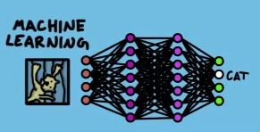
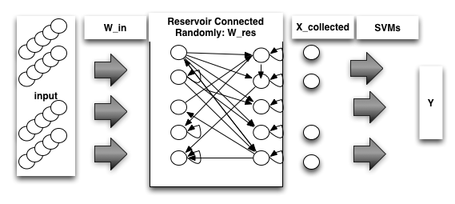

A Neural Network Architecture Combining Gated Recurrent Unit (GRU) and Support Vector Machine (SVM) for Intrusion Detection
===

The full paper on this proposal may be read at [ResearchGate](https://goo.gl/muZP5A).

## Abstract
Gated Recurrent Unit (GRU) is a recently published variant of the Long Short-Term Memory (LSTM) network, designed to solve the vanishing gradient and exploding gradient problems. However, its main objective is to solve the long-term dependency problem in Recurrent Neural Networks (RNNs), which prevents the network to connect an information from previous iteration with the current iteration. This study proposes a modification on the GRU model, having Support Vector Machine (SVM) as its classifier instead of the Softmax function. The classifier is responsible for the output of a network in a classification problem. SVM was chosen over Softmax for its efficiency in learning. The proposed model will then be used for intrusion detection, with the dataset from Kyoto University's honeypot system in 2013 which will serve as both its training and testing data.

## Citation
```
@article{afagarap2017grusvm,
	title={A Neural Network Architecture Combining Gated Recurrent Unit (GRU) and Support Vector Machine (SVM) for Intrusion Detection},
	author={Agarap, Abien Fred},
	journal={ResearchGate: DOI: 10.13140/RG.2.2.14667.59684},
	year={2017}
}
```

## Introduction
The annual cost to the global economy due to cybercrime could be as high as $575 billion, which includes both the gain to criminals and the costs to companies for defense and recovery <a href="https://goo.gl/CHFpgF">(Center for Strategic and International Studies, 2014)</a>. It is even projected that the said cost will reach $2 trillion by 2019 (<a href="https://www.juniperresearch.com/press/press-releases/cybercrime-cost-businesses-over-2trillion">Juniper, 2015</a>; <a href="https://www.forbes.com/sites/stevemorgan/2016/01/17/cyber-crime-costs-projected-to-reach-2-trillion-by-2019">Morgan, 2016</a>).


Figure 1: Image from <a href="http://docs.opencv.org/2.4/doc/tutorials/ml/introduction_to_svm/introduction_to_svm.html">(OpenCV Dev Team, 2017)</a>. The SVM algorithm outputs a hyperplane which categorizes the data, usually into two classes.



Figure 2: Image from <a href="https://www.youtube.com/watch?v=OmJ-4B-mS-Y">(Domain of Science, 2017)</a>, showing a neural network that classifies an image as "cat". The image data is converted to a series of numbers, which then gets processed by the hidden layers (violet circles in the image), and outputs the probability of to which class does the image belong.

Among the contributory felonies to cybercrime is <i>intrusions</i>, which is defined as illegal or unauthorized uses, misuses, or exploitations by either authorized users or external attackers <a href="http://ieeexplore.ieee.org/abstract/document/544350/">(Puketza et al., 1996)</a>. To identify <i>intrusions</i> in a computer system, an <i>intrusion detection system</i> (IDS) is used (<a href="http://www.juniper.net/us/en/products-services/what-is/ids-ips/">Juniper, n.d.</a>; <a href="http://ieeexplore.ieee.org/abstract/document/544350/">Puketza et al., 1996</a>). The most common method used for uncovering intrusions is the examination of patterns of user activities (<a href="http://pld.cs.luc.edu/courses/intrusion/fall05/cannady.artificial_neural_networks_for_misuse_detection.pdf">Cannady, 1998</a>; <a href="http://ieeexplore.ieee.org/abstract/document/1702202/">Denning, 1987</a>; <a href="http://static.usenix.org/event/detection99/full_papers/ghosh/ghosh.pdf">Ghosh et al., 1999</a>; <a href="http://www.juniper.net/us/en/products-services/what-is/ids-ips/">Juniper, n.d.</a>; <a href="http://docs.lib.purdue.edu/cgi/viewcontent.cgi?article=2115&context=cstech">Kumar & Spafford, 1994</a>; <a href="https://pdfs.semanticscholar.org/eb24/0f463fa57740986a92ee744c3ad75f8228e9.pdf">Mukkamala Janoski, & Sung, 2002</a>; <a href="http://ieeexplore.ieee.org/abstract/document/544350/">Puketza et al., 1996</a>).

It could be argued that the aforementioned method is quite laborious when done manually, since the data of user activities is massive in nature <a href="https://www.ll.mit.edu/ideval/data/1999data.html">(MIT Lincoln Laboratory, 1999)</a>, e.g. 3-35 megabytes of data in an eight-hour period in the 1990s <a href="http://home.eng.iastate.edu/~guan/course/backup/CprE-592-YG-Fall-2002/paper/intrusion/ai-id.pdf">(Frank, 1994)</a>. Hence, a number of researchers have studied and proposed the use of machine learning techniques to address the said problem (<a href="http://lab.iisec.ac.jp/~tanaka_lab/images/pdf/kennkyukai/kennkyukai-2016-10.pdf">Ando, 2016</a>; <a href="https://pdfs.semanticscholar.org/eb24/0f463fa57740986a92ee744c3ad75f8228e9.pdf">Mukkamala, Janoski, & Sung, 2002</a>; <a href="http://trrjournalonline.trb.org/doi/abs/10.3141/1822-05">Mukkamala & Sung, 2003</a>; <a href="http://ijsce.org/attachments/File/NCAI2011/IJSCE_NCAI2011_025.pdf">Patidar, 2011</a>). Among the said techniques is the use of <i>support vector machine</i> (SVM) and <i>artificial neural network</i> (ANN) (<a href="http://lab.iisec.ac.jp/~tanaka_lab/images/pdf/kennkyukai/kennkyukai-2016-10.pdf">Ando, 2016</a>; <a href="http://ieeexplore.ieee.org/abstract/document/5176039/">Chen, R., Cheng, Chen, Y., & Hsieh, 2009</a>; <a href="https://www.degruyter.com/view/j/piko.2004.27.issue-4/piko.2004.228/piko.2004.228.xml">Laskov, Schäfer, Kotenko, & Müller, 2004</a>; <a href="https://pdfs.semanticscholar.org/eb24/0f463fa57740986a92ee744c3ad75f8228e9.pdf">Mukkamala, Janoski, & Sung, 2002</a>; <a href="http://trrjournalonline.trb.org/doi/abs/10.3141/1822-05">Mukkamala & Sung, 2003</a>; <a href="http://ijsce.org/attachments/File/NCAI2011/IJSCE_NCAI2011_025.pdf">Patidar, 2011</a>).

In machine learning, SVM is a classification technique that separates two classes of points in a data using a "maximum margin" line - simply, a line "at the middle" (see <a href="figures/optimal-hyperplane.png">Figure 1</a>) (<a href="http://ieeexplore.ieee.org/abstract/document/6544391/">Alalshekmubarak & Smith, 2013</a>; <a href="http://dx.doi.org/10.1007/BF00994018">Cortes & Vapnik, 1995</a>; <a href="https://pdfs.semanticscholar.org/eb24/0f463fa57740986a92ee744c3ad75f8228e9.pdf">Mukkamala, Janoski, & Sung, 2002</a>; <a href="http://trrjournalonline.trb.org/doi/abs/10.3141/1822-05">Mukkamala & Sung, 2003</a>}. On the other hand, an ANN is a computational model that represents the human brain, and shows how brain cells (or <i>neurons</i>) pass information from one another (see <a href="figures/ann.jpg">Figure 2</a>) (<a href="http://pakacademicsearch.com/pdf-files/com/507/24-28%20Vol%203,%20No%201%20(2013).pdf">Gupta, 2013</a>; <a href="http://ieeexplore.ieee.org/abstract/document/485891/">Jain, Mao, & Mohiuddin, 1996</a>; <a href="https://books.google.com.ph/books?hl=en&lr=&id=7F6sJiNUL-cC&oi=fnd&pg=PP1&dq=computational+modeling+in+cognition:+principles+and+practice+lewandwosky&ots=54nC8PWRVf&sig=fRFml8rSKKRZfHph1Ko6xaAq4Bc&redir_esc=y#v=onepage&q=computational%20modeling%20in%20cognition%3A%20principles%20and%20practice%20lewandwosky&f=false">Lewandowsky & Farrell, 2011</a>; <a href="http://journal.frontiersin.org/article/10.3389/fncom.2014.00040/full">Molaie et al., 2014</a>; <a href="http://ecite.utas.edu.au/75263">Negnevitsky, 2011</a>).



Figure 3: The proposed ESN-SVM model by <a href="http://ieeexplore.ieee.org/abstract/document/6544391/">Alalshekmubarak & Smith (2013)</a> for time series classification.

This research presents a modified version of the novel approach proposed by <a href="http://ieeexplore.ieee.org/abstract/document/6544391/">Alalshekmubarak & Smith (2013)</a>, which combines the <i>echo state network</i> (ESN, a type of recurrent neural network, or RNN) and the SVM (see <a href="figures/esn-svm.png">Figure 3</a>), and use it for intrusion detection instead of time series classification.

The proposed model will use deep <i>recurrent neural networks</i> (RNNs) with <i>gated recurrent units</i> (GRUs) in place of ESN. RNNs are used for analyzing and/or predicting sequential data, which makes it a viable candidate for intrusion detection (<a href="http://ecite.utas.edu.au/75263">Negnevitsky, 2011</a>; <a href="http://colah.github.io/posts/2015-08-Understanding-LSTMs/">Olah, 2015</a>). In addition, the RNN architecture has already been used in a study for detecting credit card fraud through fraudulent behavior (by analyzing user logs) (<a href="http://lab.iisec.ac.jp/~tanaka_lab/images/pdf/kennkyukai/kennkyukai-2016-10.pdf">Ando, 2016</a>), but with the absence of SVM.

Lastly, the data to be used in this study will be the 2013 traffic data obtained by the honeypot systems in Kyoto University (<a href="http://www.takakura.com/Kyoto_data/BenchmarkData-Description-v5.pdf">Song, Takakura, & Okabe, 2006</a>), a sequential data in nature, hence the use of RNNs.
