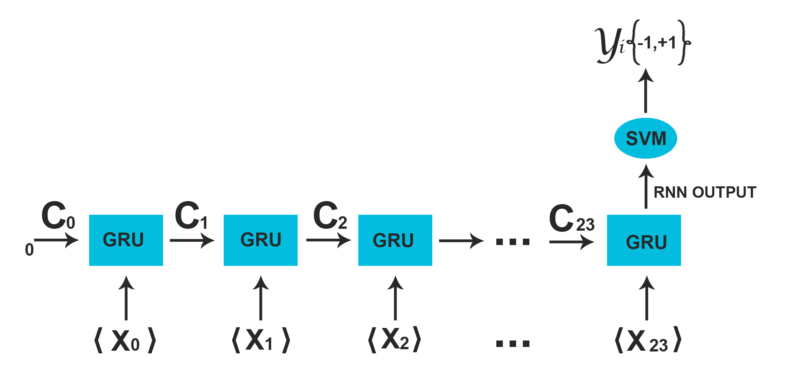

A Neural Network Architecture Combining Gated Recurrent Unit (GRU) and Support Vector Machine (SVM) for Intrusion Detection
===


[](https://doi.org/10.5281/zenodo.1045887)
[]()

The full paper on this project may be read at the following sites: [ResearchGate](https://goo.gl/muZP5A), [arXiv.org](https://arxiv.org/abs/1709.03082), [Academia.edu](https://goo.gl/8aBXpX).



## Abstract
Gated Recurrent Unit (GRU) is a recently-developed variation of the long short-term memory (LSTM) unit, both of which
are variants of recurrent neural network (RNN). Through empirical evidence, both models have been proven to be effective
in a wide variety of machine learning tasks such as natural language processing (Wen et al., 2015), speech
recognition (Chorowski et al., 2015), and text classification (Yang et al., 2016). Conventionally, like most
neural networks, both of the aforementioned RNN variants employ the Softmax function as its final output layer for its
prediction, and the cross-entropy function for computing its loss. In this paper, we present an amendment to this norm
by introducing linear support vector machine (SVM) as the replacement for Softmax in the final output layer of a GRU 
model. Furthermore, the cross-entropy function shall be replaced with a margin-based function. While there have been
similar studies (Alalshekmubarak & Smith, 2013; Tang, 2013), this proposal is primarily intended for binary
classification on intrusion detection using the 2013 network traffic data from the honeypot systems of Kyoto University.
Results show that the GRU-SVM model performs relatively higher than the conventional GRU-Softmax model. The proposed
model reached a training accuracy of ~81.54% and a testing accuracy of ~84.15%, while the latter was able to reach a
training accuracy of ~63.07% and a testing accuracy of ~70.75%. In addition, the juxtaposition of these two final output
layers indicate that the SVM would outperform Softmax in prediction time - a theoretical implication which was supported
by the actual training and testing time in the study.

## Citation

To cite the paper, kindly use the following BibTex entry:
```
@article{agarap2017neural,
  title={A Neural Network Architecture Combining Gated Recurrent Unit (GRU) and Support Vector Machine (SVM) for Intrusion Detection in Network Traffic Data},
  author={Agarap, Abien Fred},
  journal={arXiv preprint arXiv:1709.03082},
  year={2017}
}
```

To cite the repository/software, kindly use the following BibTex entry:
```
@misc{abien_fred_agarap_2017_1045887,
  author       = {Abien Fred Agarap},
  title        = {AFAgarap/gru-svm v0.3.11-alpha},
  month        = nov,
  year         = 2017,
  doi          = {10.5281/zenodo.1045887},
  url          = {https://doi.org/10.5281/zenodo.1045887}
}
```

## Usage

First, clone this repository:

```buildoutcfg
git clone https://github.com/AFAgarap/gru-svm.git/
```

Then, install the required libraries:

```buildoutcfg
sudo pip install -r requirements.txt
```

The following are the parameters for the module (`gru_svm_main.py`) implementing the GRU-SVM class found in `gru-svm/models/gru_svm/gru_svm.py`:

```buildoutcfg
usage: gru_svm_main.py [-h] -o OPERATION [-t TRAIN_DATASET] -v
                       VALIDATION_DATASET -c CHECKPOINT_PATH [-l LOG_PATH]
                       [-m MODEL_NAME] -r RESULT_PATH

GRU+SVM for Intrusion Detection

optional arguments:
  -h, --help            show this help message and exit

Arguments:
  -o OPERATION, --operation OPERATION
                        the operation to perform: "train" or "test"
  -t TRAIN_DATASET, --train_dataset TRAIN_DATASET
                        the NumPy array training dataset (*.npy) to be used
  -v VALIDATION_DATASET, --validation_dataset VALIDATION_DATASET
                        the NumPy array validation dataset (*.npy) to be used
  -c CHECKPOINT_PATH, --checkpoint_path CHECKPOINT_PATH
                        path where to save the trained model
  -l LOG_PATH, --log_path LOG_PATH
                        path where to save the TensorBoard logs
  -m MODEL_NAME, --model_name MODEL_NAME
                        filename for the trained model
  -r RESULT_PATH, --result_path RESULT_PATH
                        path where to save the actual and predicted labels
```

Then, use the sample data in `gru-svm/dataset/train/train_data.npy` for training the proposed GRU-SVM:

```buildoutcfg
cd gru-svm
python3 gru_svm_main.py --operation "train" \
--train_dataset dataset/train/train_data.npy \
--validation_dataset dataset/test/test_data.npy \
--checkpoint_path models/checkpoint/gru_svm \
--model_name gru_svm.ckpt \
--log_path models/logs/gru_svm \
--result_path results/gru_svm
```

After training, the model can be used as follows:

```buildoutcfg
python3 gru_svm_main.py --operation "test" \
--validation_dataset dataset/test/test_data.npy \
--checkpoint_path models/checkpoint/gru_svm \
--result_path results/gru_svm
```

Or simply use the prepared script files:

```buildoutcfg
# Makes the script files executable
sudo chmod +x setup.sh
sudo chmod +x run.sh

# Installs the pre-requisite software and libraries
./setup.sh

# Runs the GRU-SVM for intrusion detection
./run.sh
```

## Results

The results of the study may be found in [`gru-svm/results`](https://github.com/AFAgarap/gru-svm/tree/master/results).

## License

	A Neural Network Architecture Combining Gated Recurrent Unit (GRU) and
	Support Vector Machine (SVM) for Intrusion Detection in Network Traffic Data
	Copyright (C) 2017  Abien Fred Agarap

	This program is free software: you can redistribute it and/or modify
	it under the terms of the GNU Affero General Public License as published
	by the Free Software Foundation, either version 3 of the License, or
	(at your option) any later version.

	This program is distributed in the hope that it will be useful,
	but WITHOUT ANY WARRANTY; without even the implied warranty of
	MERCHANTABILITY or FITNESS FOR A PARTICULAR PURPOSE.  See the
	GNU Affero General Public License for more details.

	You should have received a copy of the GNU Affero General Public License
	along with this program.  If not, see <http://www.gnu.org/licenses/>.
