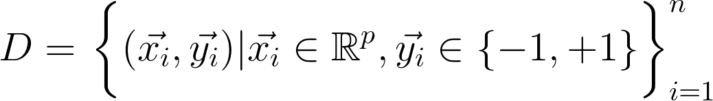
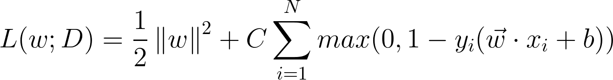

Intrusion Detection using Support Vector Machine (SVM) as Classifier in a Deep Recurrent Neural Network (RNN)
===

The full paper on this proposal may be read at [ResearchGate](https://goo.gl/muZP5A)

## Abstract
Gated Recurrent Unit (GRU) is a recently published variant of the Long Short-Term Memory (LSTM) network, designed to solve the vanishing gradient and exploding gradient problems. However, its main objective is to solve the long-term dependency problem in Recurrent Neural Networks (RNNs), which prevents the network to connect an information from previous iteration with the current iteration. This study proposes a modification on the GRU model, having Support Vector Machine (SVM) as its classifier instead of the Softmax function. The classifier is responsible for the output of a network in a classification problem. SVM was chosen over Softmax for its efficiency in learning. The proposed model will then be used for intrusion detection, with the dataset from Kyoto University's honeypot system in 2013 which will serve as both its training and testing data.

## Citation
```
@article{afagarap2017grusvm,
	author={Agarap, Abien Fred},
	title={Intrusion Detection using Support Vector Machine (SVM) as Classifier in a Deep Recurrent Neural Network (RNN)},
	school={Adamson University},
	year={2017},
	note={unpublished thesis}
}
```

<!--  from [Chris Olah's Blog](http://colah.github.io/posts/2015-08-Understanding-LSTMs/)

 -->