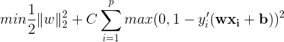

## The GRU-SVM Neural Network Architecture

The proposed [GRU-SVM model](https://github.com/AFAgarap/gru-svm/blob/master/models/gru_svm/gru_svm.py) may be summarized as follows:

1. Input the dataset features {x i | x i ∈ R p } to the GRU model.
2. Initialize the learning parameters *weights* and *biases* with
arbitrary values (their initial values do not matter, since they
will be adjusted through training).
3. The cell states of GRU are computed based on the input
features x_{i} , and the initialized learning parameters *weights*
and *biases*.
4. At the last time step, i.e. last input feature, the prediction of
the model is computed using the decision function of SVM:
f(x) = sign(wx + b).
5. The loss of the neural network is computed using the following equation:

6. To minimize the neural network loss, an optimization algorithm is used (for this study, the Adam optimizer was
used). The optimization algorithm adjusts the weights and
biases based on the computed loss.

The proposed GRU-SVM architecture, with `n-1` unit inputs, and SVM as its classifier.