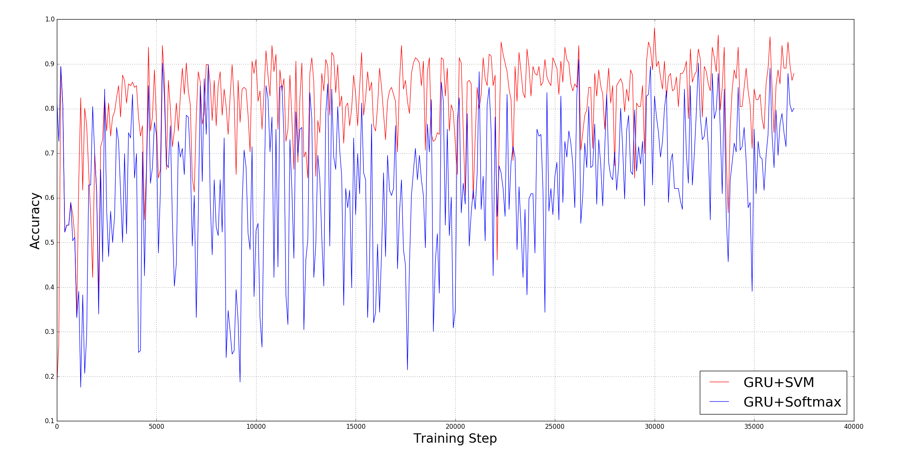
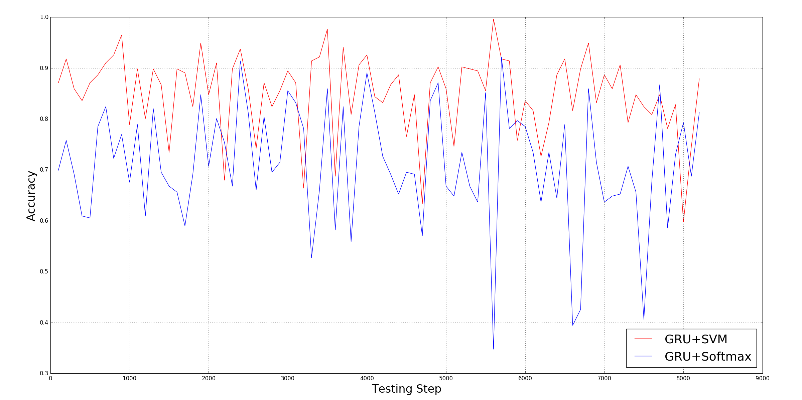

## Results

All experiments in this study were conducted on a laptop computer with Intel Core(TM) i5-6300HQ CPU @ 2.30GHz x 4, 16GB
of DDR3 RAM, and NVIDIA GeForce GTX 960M 4GB DDR5 GPU. The hyper-parameters used for both the proposed and the
conventional models were assigned by hand, and through hyper-parameter optimization/tuning.

#### Hyper-parameters used in both neural networks
|Hyperparameters|GRU+SVM|GRU+Softmax|
|--------------|------|-----------|
|BATCH_SIZE|256|256|
|CELL_SIZE|256|256|
|DROPOUT_RATE|0.85|0.8|
|EPOCHS|5|5|
|LEARNING RATE|1e-5|1e-6
|SVM_C|0.5|n/a|

#### GRU+Softmax binary classification statistical measures

|Variable | Training results | Testing results|
|---------|------------------|-------------------|
|False positive|3017548|32255|
|False negative|487175|582105|
|True positive|5031465|731365|
|True negative|955012|757315|
Accuracy|63.073973786244097%|70.78705112598904%|

#### GRU+SVM binary classification statistical measures

|Variable | Training results | Testing results|
|---------|------------------|-------------------|
|False positive|889327|192635|
|False negative|862419|140535|
|True positive|4656221|1172935|
|True negative|3083233|596935|
Accuracy|81.54347184760621%|84.15769552647596%|

The graph below summarizes the training accuracy of GRU-SVM and GRU-Softmax:

The proposed GRU-SVM model was able to finish its training in 16 minutes and 43 seconds. On the other hand, the
conventional GRU-Softmax model was able to finish its training in 17 minutes and 11 seconds. Both trainings consist of
37,075 steps (1,898,240 * 5 mod 256).

The graph below summarizes the testing accuracy of GRU-SVM and GRU-Softmax:

The proposed GRU-SVM model was able to finish its training in 1 minute and 22 seconds. On the other hand, the
conventional GRU-Softmax model was able to finish its training in 1 minute and 40 seconds. Both testings consist of
8,215 steps (2103040 * 5 mod 256).
